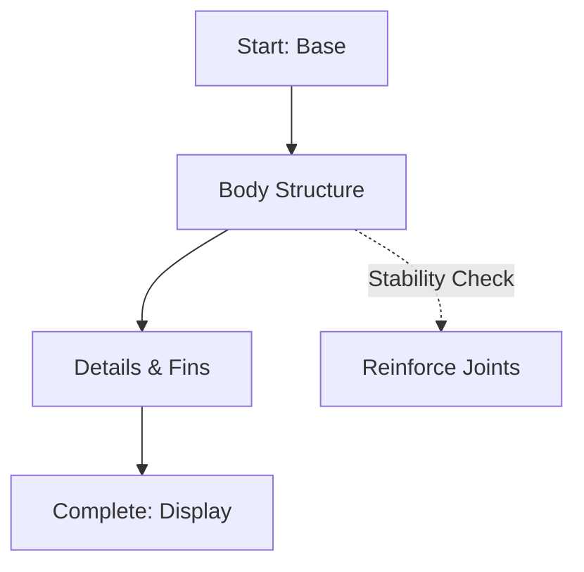

## Overview

Build the Yellow DirkShark MOC using LEGO pieces from the 10256 Taj Mahal set as an alternate build. This guide walks you through layer-by-layer assembly, intricate techniques, custom yellow and brand color (`#3B82F6`) integration, and stability tips. Gather all parts first and work in a well-lit space.

<Columns cols={3}>
  <Card title="Total Pieces" icon="package" href="#materials">
    Approximately 5,972 pieces including custom yellows.
  </Card>
  <Card title="Build Time" icon="clock" href="#timeline">
    20-30 hours over several sessions.
  </Card>
  <Card title="Difficulty" icon="alert-triangle" href="#techniques">
    Intermediate to advanced with SNOT techniques.
  </Card>
</Columns>

## Preparation

Review the parts inventory from Rebrickable instructions. Sort pieces by color, especially yellows and blues matching `#3B82F6` for fins and accents.

<Callout kind="info">
  Download the official PDF instructions from Rebrickable and print Stage 1-10 for reference. Use a parts separator tray to organize bricks.
</Callout>

### Materials and Tools

| Category | Items | Notes |
|----------|-------|-------```
| Baseplates | 16x32 gray (x2) | Foundation stability |
| Yellow Bricks | 1x1 to 2x8 | Main body (500+) |
| Blue Plates | 1x2, 1x4 (`#3B82F6` tint) | Fins and details |
| Tools | Brick separator, tile tweezers | Essential for SNOT |
| Minifigs | Shark crew (optional) | Display enhancement |

## Build Phases

Follow these phases using Tabs for focused instructions. Each Tab contains Steps for that layer.

<Tabs>
  <Tab title="Phase 1: Base Layer" icon="layers">

<Steps>
  <Step title="Lay Foundation" icon="square">
    Place two 16x32 gray baseplates side-by-side. Connect with 2x8 yellow plates underneath for reinforcement.

````markdown
    Base layout:
    - 16x32 gray x2
    - Yellow plates for seams
````
  </Step>
  <Step title="Build Perimeter Walls" icon="wall">
    Stack 1x4 yellow bricks around edges to height 4 plates. Use technic pins at corners for stability.
  </Step>
  <Step title="Add Internal Supports" icon="grid">
    Insert 1x6 technic beams crosswise every 8 studs.
  </Step>
</Steps>

  </Tab>

  <Tab title="Phase 2: Body Structure" icon="shark">

<Steps>
  <Step title="Form Hull Outline" icon="circle">
    Build curved hull using curved yellow slopes (radii 3-5). Alternate with plates for smooth contour.
  </Step>
  <Step title="Integrate Brand Color" icon="palette">
    Accent dorsal fin with `#3B82F6` blue plates. Stack 1x2 tiles for gradient effect.
  </Step>
  <Step title="SNOT Techniques" icon="lego-brick">
    Rotate bricks 90° for shark jaw angles using clips and bars.
  </Step>
</Steps>

  </Tab>

  <Tab title="Phase 3: Details and Fins" icon="zap">

<Steps>
  <Step title="Attach Side Fins" icon="arrow-left-right">
    Use ball joints for articulated fins. Secure with yellow pin connectors.
  </Step>
  <Step title="Add Teeth and Eyes" icon="eye">
    White 1x1 cones for teeth; trans-clear tiles for eyes with black pupils.
  </Step>
  <Step title="Final Touches" icon="paint-brush">
    Apply stickers or custom prints for DirkShark logos.
  </Step>
</Steps>

  </Tab>
</Tabs>



## Advanced Techniques

<Expandable title="Intricate Architectural Elements" default-open="true">
Use SNOT (Studs Not On Top) for non-standard angles:

- Clip plates to bars for fins.
- Inverted slopes for underbelly curves.
- Layer offsets by half-stud using tiles.

For `#3B82F6` integration, mix blue elements seamlessly with yellows to evoke ocean depths.
</Expandable>

<Expandable title="Custom Color Matching">
Match `#3B82F6` using LEGO 1x1 round plates in Bright Blue (part 40701). Test gradients before full assembly.
</Expandable>

## Stability Tips

<Callout kind="tip">
Reinforce high-stress areas like fins with technic pins every 4 layers. Build upside-down for base stability, then flip. Avoid over-tight stacking—leave micro-adjustments for final alignment.
</Callout>

<Callout kind="alert">
If warping occurs, disassemble and add cross-bracing. Test lift by corners after each phase.
</Callout>

## Troubleshooting

Common issues:

- **Wobbly base:** Add hidden technic frames.
- **Color mismatch:** Substitute with closest LEGO yellows (Bright Yellow).
- **Piece shortages:** Check Rebrickable substitutes list.

Your Yellow DirkShark now stands ready for display. Share photos on Rebrickable!