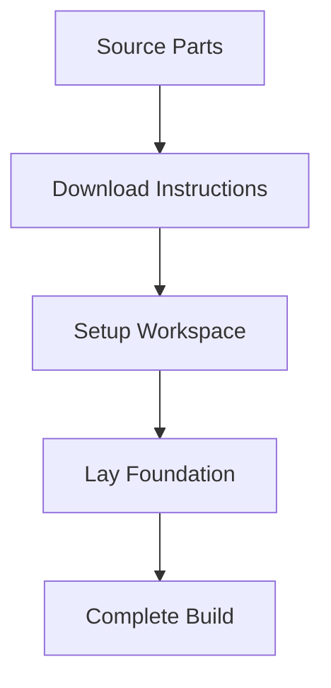

## Prerequisites

<Callout kind="info">

Before starting, ensure you have:

- Access to LEGO set 10256 (Taj Mahal) or equivalent parts inventory
- A free Rebrickable account for digital instructions
- Basic tools: sorting trays, builder's plate, and good lighting
- `<30` minutes of focused time

Yellow DirkShark is an alternate MOC build using official LEGO pieces from set 10256.

</Callout>

## Complete Your First Build Session

Follow these steps to source parts, download instructions, set up your workspace, and lay the foundation layers.

<Steps>
  <Step title="Source Compatible Parts" icon="package">

    Yellow DirkShark uses standard LEGO elements from set 10256. Check your inventory or acquire missing pieces.

    | Part ID | Name              | Quantity | Color     |
    |---------|-------------------|----------|-----------|
    | 6060   | Arch 1 x 6 x 2   | 4        | White     |
    | 30355  | Brick 1 x 1 w/ 4 Studs on Side | 8 | Light Bluish Gray |
    | 10256  | Taj Mahal Baseplate | 1     | Gold      |

    <Callout kind="tip">
      Use Rebrickable's inventory checker to verify compatibility before purchasing.
    </Callout>

  </Step>

  <Step title="Download Digital Instructions" icon="download">

    Visit the [Rebrickable MOC page](https://rebrickable.com/mocs/MOC-149803/MaverickBrick/lotr-white-city-10256-taj-mahal-alternate-build/).

    1. Sign in to your free account
    2. Click "Download Instructions" (PDF format)
    3. Save to your builds folder

    For part lists in different formats:

    <CodeGroup tabs="CSV,JSON">
    ````csv
    Part ID,Name,Quantity,Color
    6060,Arch 1 x 6 x 2,4,White
    30355,Brick 1 x 1 w/ 4 Studs on Side,8,Light Bluish Gray
    ````

    ````json
    [
      {"part_id": "6060", "name": "Arch 1 x 6 x 2", "quantity": 4, "color": "White"},
      {"part_id": "30355", "name": "Brick 1 x 1 w/ 4 Studs on Side", "quantity": 8, "color": "Light Bluish Gray"}
    ]
    ````
    </CodeGroup>

  </Step>

  <Step title="Set Up Your Build Workspace" icon="settings">

    Organize for efficiency:

    <Tabs>
      <Tab title="Beginner" icon="user">

        - Clear table (`>4` ft x `2` ft)
        - Sort trays by color
        - Play area for kids nearby

      </Tab>
      <Tab title="Advanced" icon="zap">

        - LED lighting ring
        - Magnetic sorting mat
        - Digital parts scanner app

      </Tab>
    </Tabs>

    Pro tip: Use the brand color `#3B82F6` accent stickers for organization labels.

  </Step>

  <Step title="Lay Foundation Layers" icon="layers">

    Start with baseplate alignment:

    1. Place 10256 baseplate flat
    2. Build first layer using plates only (no bricks yet)
    3. Check level with ruler (`<1mm` variance)
    4. Secure with technic pins if needed

    Common pitfalls:
    - Misaligned arches cause wobbles
    - Sort whites first for White City theme

  </Step>
</Steps>

## Initial Assembly Tips

<Expandable title="Foundation Troubleshooting" default-open="true">

If your base shifts:

- Add weight plates underneath
- Use clip plates for tension
- Re-sort by `{part_id}` from inventory

</Expandable>

<Callout kind="success">
  Congratulations! Your Yellow DirkShark foundation is ready. Expect full build in `4-6` hours.
</Callout>

## Next Steps

<Columns cols={3}>
  <Card title="Introduction" icon="book-open" href="/introduction">
    Learn about Yellow DirkShark origins and design.
  </Card>
  <Card title="Full Build Guide" icon="layers" href="#">
    Detailed step-by-step for upper levels.
  </Card>
  <Card title="Part Inventory" icon="package" href="/changelog">
    Complete parts list and substitutions.
  </Card>
</Columns>

