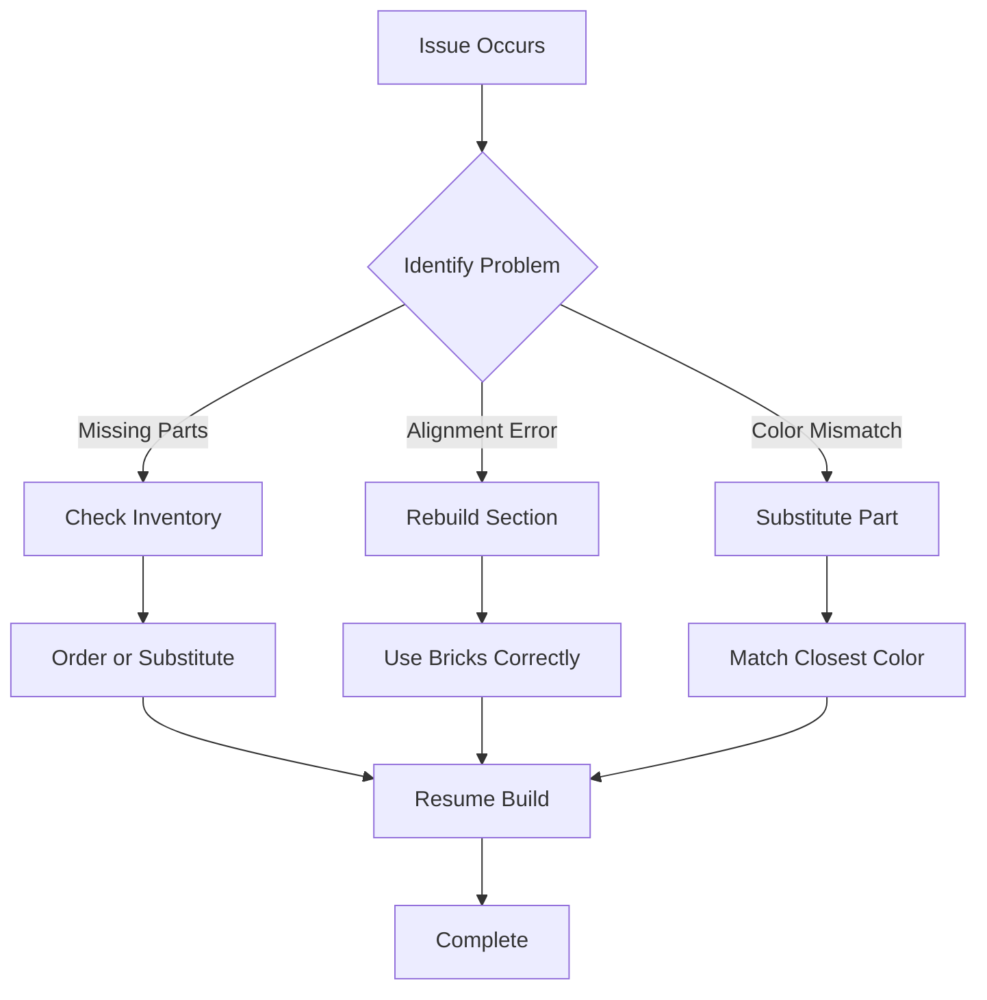

## Quick Troubleshooting Flow

Follow this simple process to diagnose and fix most issues during your Yellow DirkShark build.



<Callout kind="tip">
  Always double-check the official instructions PDF before assuming a problem. Download it from the [Rebrickable page](https://rebrickable.com/mocs/MOC-149803/MaverickBrick/lotr-white-city-10256-taj-mahal-alternate-build/#comments).
</Callout>

## Handling Missing or Substitute Parts

You might encounter missing pieces from the original LEGO set 10256 or need substitutes for rare parts.

<Steps>
  <Step title="Verify Inventory" icon="search">
    Count all parts against the parts list in Step 1 of the instructions.

    Use the Rebrickable inventory checker:

    | Part Number | Quantity Needed | Your Count |
    |-------------|-----------------|------------|
    | 6060       | 12              |            |
    | 6157       | 8               |            |
    | 10256-1    | 1 (set)         |            |
  </Step>
  <Step title="Find Substitutes" icon="swap">
    Search Rebrickable for alternatives:

````markdown
```javascript
// Example: Use BrickLink API for substitutes
const substitutes = await fetch('https://api.bricklink.com/api/store/v3/catalog/items/get?route=part&color_id=1&type_id=P&brick_id=6060');
```
````

    Common sub for white arches: Part 6060 → 88057 (modern equivalent).
  </Step>
  <Step title="Order Parts" icon="shopping-cart">
    Order from BrickLink or LEGO Pick-a-Brick. Expect 3-5 day delivery.
  </Step>
</Steps>

<Callout kind="alert">
  Never force substitutes that don't fit snugly—they cause alignment issues later.
</Callout>

## Fixing Alignment Issues in Complex Sections

The White City towers and walls have intricate angles. Misalignments often occur in Steps 45-60.

<Tabs>
  <Tab title="Towers" icon="building-2">
    <Expandable title="Tower Base Fix" default-open="true">
      Ensure 45-degree plates align flush:

      1. Remove pins from Step 47.
      2. Reinsert Technic pins vertically.
      3. Press plates down evenly.

      <Image
        src="https://example.com/tower-alignment.png"
        alt="Correct tower base alignment"
        width="600"
        height="400"
      />
    </Expandable>
  </Tab>
  <Tab title="Walls" icon="wall">
    Curve walls gently:

    - Use clip plates (Part 4085) to hold curves.
    - Avoid over-tightening hinges.

    Common error: Hinge plates flipped → rotate 180 degrees.
  </Tab>
</Tabs>

## Addressing Color Matching Discrepancies

Yellow DirkShark uses whites and golds from 10256, but fading or batch variations occur.

| Issue              | Solution                          | Acceptable Substitute |
|--------------------|-----------------------------------|-----------------------|
| Faded White (Nougat)| Use Pearl White (Color 11)       | Trans-Clear           |
| Gold Variation     | Mix old/new gold plates          | Flat Gold (Color 5)   |
| Yellow Accents     | Bright Yellow only               | None—order exact      |

<Callout kind="info">
  Test color fits in a small section first. LEGO colors shift slightly by production year.
</Callout>

## Community Resources and Next Steps

Get help from builders who've completed this MOC.

<Columns cols={3}>
  <Card title="Rebrickable Forum" icon="message-circle" href="https://rebrickable.com/mocs/MOC-149803/#comments" target="_blank">
    Post photos of your issue for quick advice.
  </Card>
  <Card title="Reddit r/lego" icon="users" href="https://reddit.com/r/lego" target="_blank">
    Share build progress and ask for tips.
  </Card>
  <Card title="BrickLink Forums" icon="package" href="https://www.bricklink.com/v2/reference/reference.page" target="_blank">
    Part-specific substitution advice.
  </Card>
</Columns>

<ExpandableGroup>
  <Expandable title="Advanced Tips: Custom Modifications">
    For custom towers, reinforce with internal Technic frames to prevent wobbling.
  </Expandable>
</ExpandableGroup>

If issues persist, revisit the [Quickstart guide](/quickstart) for build basics or check the [Introduction](/introduction). Your build should shine like the White City!